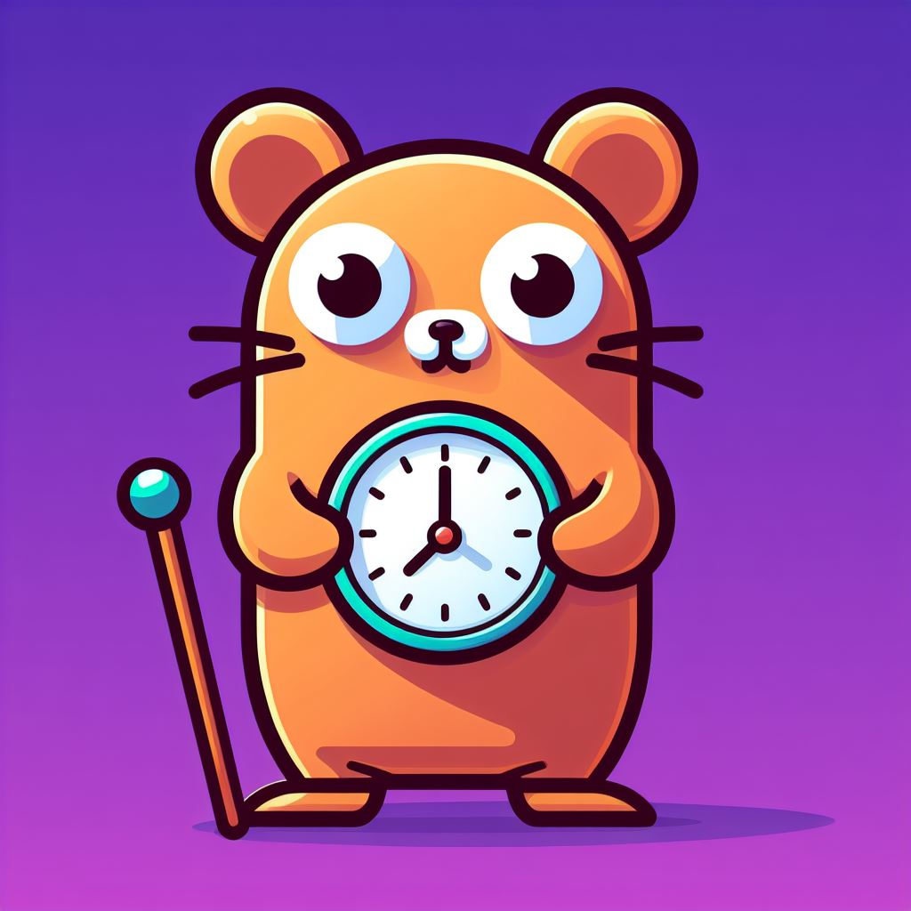

# amiGoWraptime
<!-- Improved compatibility of back to top link: See: https://github.com/othneildrew/Best-README-Template/pull/73 -->
<a name="readme-top"></a>
<!--
*** Thanks for checking out the Best-README-Template. If you have a suggestion
*** that would make this better, please fork the repo and create a pull request
*** or simply open an issue with the tag "enhancement".
*** Don't forget to give the project a star!
*** Thanks again! Now go create something AMAZING! :D
-->


<!-- PROJECT SHIELDS -->
<!--
*** I'm using markdown "reference style" links for readability.
*** Reference links are enclosed in brackets [ ] instead of parentheses ( ).
*** See the bottom of this document for the declaration of the reference variables
*** for contributors-url, forks-url, etc. This is an optional, concise syntax you may use.
*** https://www.markdownguide.org/basic-syntax/#reference-style-links
-->
[![Contributors][contributors-shield]][contributors-url]
[![Forks][forks-shield]][forks-url]
[![Stargazers][stars-shield]][stars-url]
[![Issues][issues-shield]][issues-url]
[![MIT License][license-shield]][license-url]
[![LinkedIn][linkedin-shield]][linkedin-url]


<!-- PROJECT LOGO -->
<br />
<div align="center">
  <a href="https://github.com/rzvpoi/amiGoWraptime">
    
  </a>

  <h3 align="center">amiGoWraptime</h3>

  <p align="center">
    Asterisk Wrap-up Time manager


   <a href="https://github.com/rzvpoi/amiGoWraptime/issues">Report Bug</a>
    ·
    <a href="https://github.com/rzvpoi/amiGoWraptime/issues">Request Feature</a>
  </p>
</div>


<!-- TABLE OF CONTENTS -->
<details>
  <summary>Table of Contents</summary>
  <ol>
    <li>
      <a href="#about-the-project">About The Project</a>
      <ul>
      </ul>
    </li>
    <li>
      <a href="#getting-started">Getting Started</a>
      <ul>
        <li><a href="#installation">Installation</a></li>
      </ul>
    </li>
    <li><a href="#usage">Usage</a></li>
    <li><a href="#license">License</a></li>
    <li><a href="#contact">Contact</a></li>
  </ol>
</details>

## ⚠️ Warning
This project is currently under active development and is not considered a finished product. While it aims to optimize Asterisk Wrap-up Time, certain features may be incomplete or subject to changes.

<!-- ABOUT THE PROJECT -->
## About The Project

This application is designed to address the issue of Asterisk Wrap-up Time by automatically initiating a pause status for agents in a queue once they have completed a call for a set amount of time. 

The purpose of this feature is to optimize post-call activities and streamline workflow efficiency, ensuring that agents have the necessary time and resources for wrap-up tasks without manual intervention. 

By implementing this solution, the application aims to enhance overall call center performance and improve the handling of post-call processes within the Asterisk system.

<p align="right">(<a href="#readme-top">back to top</a>)</p>

## Built with Go

The application was built with Go and uses the [amigo](https://pkg.go.dev/github.com/ivahaev/amigo) package to connec to Asterisk AMI

<p align="right">(<a href="#readme-top">back to top</a>)</p>

<!-- GETTING STARTED -->
## Getting Started

This is an example of how you may give instructions on setting up your project locally.
To get a local copy up and running follow these simple example steps.

### Installation

_Below is an example of how you can instruct your audience on installing and setting up your app. This template doesn't rely on any external dependencies or services._

1. Get a free API Key at [https://example.com](https://example.com)
2. Clone the repo
   ```sh
   git clone https://github.com/your_username_/Project-Name.git
   ```
3. Install NPM packages
   ```sh
   npm install
   ```
4. Enter your API in `config.js`
   ```js
   const API_KEY = 'ENTER YOUR API';
   ```

<p align="right">(<a href="#readme-top">back to top</a>)</p>


<!-- USAGE EXAMPLES -->
## Usage

Use this space to show useful examples of how a project can be used. Additional screenshots, code examples and demos work well in this space. You may also link to more resources.

_For more examples, please refer to the [Documentation](https://example.com)_

<p align="right">(<a href="#readme-top">back to top</a>)</p>


<!-- LICENSE -->
## License

Distributed under the MIT License. See `LICENSE` for more information.

<p align="right">(<a href="#readme-top">back to top</a>)</p>


<!-- CONTACT -->
## Contact

Poienariu Razvan - [LinkedIn](https://ro.linkedin.com/in/razvan-poienariu) - razvanpoienariu@gmail.com

Project Link: [https://github.com/rzvpoi/amiGoWraptime](https://github.com/rzvpoi/amiGoWraptimee)

<p align="right">(<a href="#readme-top">back to top</a>)</p>


